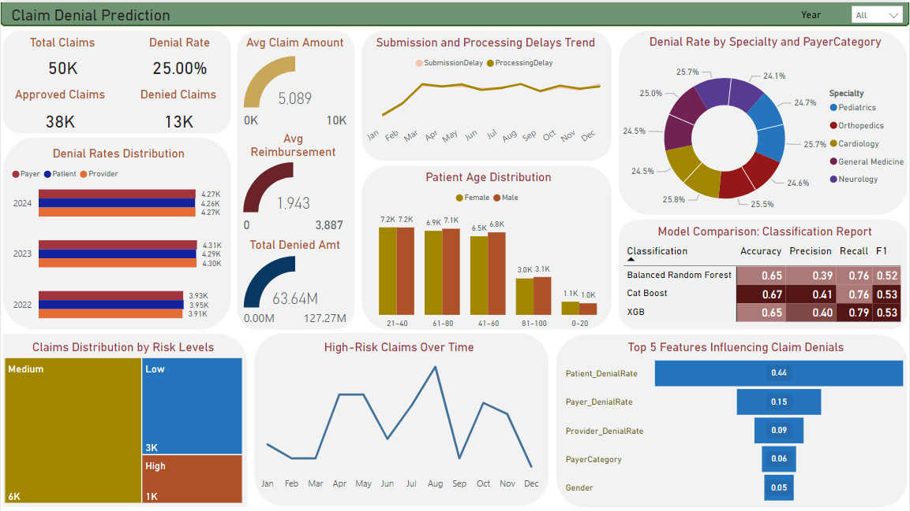

# **Claim Denial Prediction**

## **Project Summary**  
This project focuses on analyzing and predicting healthcare claim denials using synthetic data from 2022–2024. It aims to provide actionable insights for healthcare providers and payers to reduce denial rates and improve the efficiency of claim processing. By leveraging predictive modeling and visual analytics, the project identifies key risk factors for claim denials and highlights business-relevant metrics segmented by patient, provider, and payer demographics.  

---

## **Business Questions Addressed**  

1. **What is the overall claim denial rate, and how has it changed over time?**  
   - The overall claim denial rate is 25%. Trends reveal seasonal variations in denial rates, with spikes in certain months due to submission and processing delays.  

2. **Which patient demographics are more prone to claim denials?**  
   - Patients aged 41–60 have the highest volume of claims, but denial rates are highest in patients aged 0–20. Male and female patients have nearly equal denial rates, with no significant gender disparity.  

3. **What are the primary factors influencing claim denials?**  
   - The top factors include patient denial rates, payer and provider denial rates, payer category, and external factors such as processing delays.  

4. **Which payers, providers, or specialties have the highest denial rates?**  
   - Denial rates vary by specialty, with orthopedics and cardiology showing slightly higher rates compared to pediatrics and general medicine.  

5. **How do submission and processing delays impact claim denials?**  
   - A positive correlation exists between submission/processing delays and denial rates, particularly in high-risk claims.  

6. **What proportion of claims fall under low, medium, and high-risk categories?**  
   - Approximately 6% of claims are classified as high-risk, with medium-risk claims accounting for the majority.  

7. **Which predictive model performs best for claim denial classification?**  
   - Among the models evaluated (Balanced Random Forest, CatBoost, XGBoost), CatBoost demonstrated the highest F1 score of 0.53. While CatBoost exhibited the highest F1 score, XGBoost is preferred due to a superior cost-weighted metric. The total cost of errors for XGBoost was $0 compared to CatBoost’s $855,900.  

---

## **Data Overview**  

- **Source**: Synthetic healthcare data (2022–2024).  
- **Key Features**:  
  - **Patient Demographics**: Age, gender distribution, and admission activity.  
  - **Claim Details**: Total claims, approved/denied claims, denial rates, and denied amounts.  
  - **Revenue Metrics**: Average reimbursement and total denied amounts.  
  - **Payer and Provider Information**: Categorization based on denial rates.  
  - **External Factors**: Submission and processing delays impacting denial trends.  

- **Preparation**:  
  - Data was sourced from multiple tables (patients, claims, revenue, payers, providers, and external factors).  
  - Data cleaning, feature engineering, and aggregation were performed using Python (Pandas, NumPy).  
  - Key metrics like denial rates, risk levels, and reimbursement trends were calculated to facilitate analysis and visualization.  

---

## **Key Insights**  

1. **Denial Trends**:  
   - The denial rate is consistent at 25% over three years, with slight monthly variations.  
   - Delays in submission and processing correlate with higher denial rates.  

2. **Risk Analysis**:  
   - High-risk claims exhibit clear seasonal patterns, peaking in specific months.  
   - Segmentation reveals that 6% of claims fall into the high-risk category, which requires immediate attention.  

3. **Revenue Impact**:  
   - Average denied claim amount is $5,089, contributing to a total denied amount of $63.64M over three years.  
   - Effective reduction in denial rates could significantly impact revenue recovery.  

4. **Patient Demographics**:  
   - Patients aged 41–60 are the primary claimants, but younger patients (0–20) face the highest denial rates.  

5. **Provider & Specialty Denial Rates**:  
   - Variations exist across specialties, with orthopedics and cardiology having slightly higher denial rates.  

6. **Model Performance**:  
   - **XGBoost is the recommended model for future enhancements due to its superior cost-weighted performance, achieving $0 in error costs compared to CatBoost’s $855,900.**  

---

## **Recommendations**  

1. **Focus on High-Risk Claims**:  
   - Prioritize addressing high-risk claims to reduce denial rates and improve overall efficiency.  

2. **Optimize Submission Processes**:  
   - Identify and address bottlenecks in submission and processing to minimize delays and denial rates.  

3. **Collaborate with Providers**:  
   - Work closely with providers in specialties like orthopedics and cardiology to understand the root causes of higher denial rates.  

4. **Enhance Predictive Models**:  
   - Adopt XGBoost for claim denial prediction due to its superior cost-weighted metric performance.  
   - Refine the model further by incorporating additional external factors and optimizing feature selection.  

---

## **Tools & Technologies**  

- **Data Preparation**: Python (Pandas, NumPy).  
- **Modeling**: Machine learning algorithms (CatBoost, XGBoost, Balanced Random Forest).  
- **Visualization**: Power BI for interactive dashboards.  
- **Evaluation Metrics**: Accuracy, Precision, Recall, F1 Score  

---

## **Next Steps**  

1. Implement real-time monitoring for high-risk claims.  
2. Expand the analysis to include additional external factors (e.g., economic conditions or regulatory changes).  
3. Automate workflows for claim denial predictions and recommendations to drive operational efficiency.  
